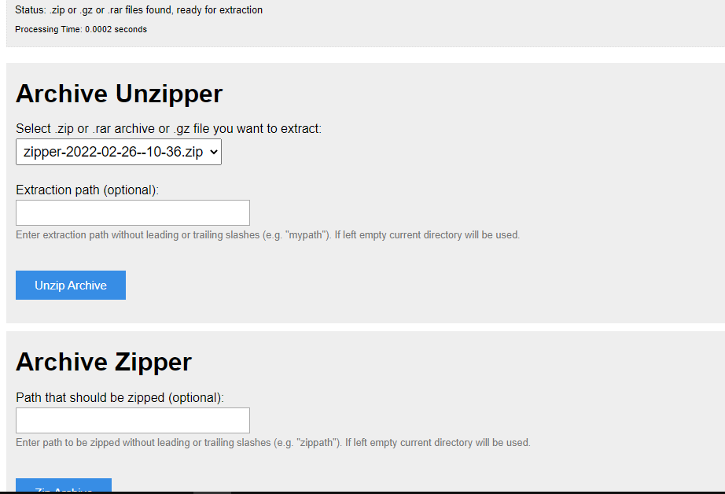

# File Unzipper

The File Unzipper extracts .zip and .rar archives or .gz/tar.gz files on webservers. It detects .zip/.rar/.tar.gz/.gz archives and let you choose which one to extract (if there are multiple archives available).
It also supports creating archives.

It's handy if you do not have shell access. E.g. if you want to upload a lot of files (php framework or image collection) as archive - because it is much faster than uploading each file by itself.

use to compress and extract your resources if the hosting you are using does not support it

## Requirements    
PHP 5.3 and newer
(If you still run PHP < 5.6 you should consider updating PHP. These old PHP versions do not get any security updates and your site may be vulnerable.)

## Usage
* Download unzipper.php and place it in the same directory as your .zip archive.
* In Browser type URL to your-url/unzip.php

### Archive unzipper
* Choose .zip, .rar archive or .gz file you want to extract
* (Optional) select an extraction path, defaults to current directory
* Click "Unzip Archive"

### Archive zipper
* (Optional) Set path to zip, defaults to current directory
* Click "Zip Archive"

## License
Released under GNU/GPL v3

## Screenshot   

